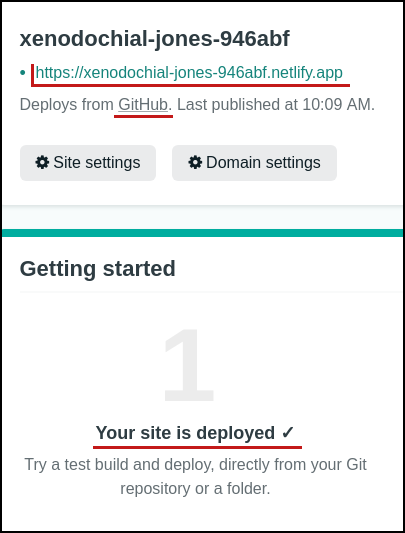

# Keiko Escape Game

Bienvenue sur le Keiko Escape Game de Theodo. Le but de ce projet est de créer ton propre escape game en web 😯 ! Tu trouveras sur cette page toutes les informations nécessaires pour le faire, notamment les procédures d'installation du projet, comment le lancer en local sur ta machine et comment le déployer en production avec ton compte github 🥳 !

Afin de pouvoir réaliser ce projet sereinement, un exemple d'escape game tout simple a été codé dans ce repo. Même si réutiliser le code de l'exemple n'est pas obligatoire, ça pourrait s'avérer utile 😉

En ce qui concerne le thème et le type d'escape game, le choix est totalement libre ! Nous avons juste défini une liste de fonctionnalités qui sont utiles à tout bon escape game.

## Prérequis

Avant de commencer, tu as besoin de nodejs et npm, deux outils utilisés quasiment tout le temps à Theodo :

```bash
node --version
# v10+
```

```bash
npm --version
# 6+
```

[Si tu ne connais pas ces outils, tu peux suivre cette documentation NPM pour les installer sur ta machine](https://docs.npmjs.com/downloading-and-installing-node-js-and-npm)

## Installation

### Creation du repo

Pour te faciliter la vie ce repo est un template, il te suffit de cliquer sur le bouton **Deploy to netlify** pour créer un repo à partir de ce boilerplate:

<a href="https://app.netlify.com/start/deploy?repository=https://github.com/theodo/dojo-escape-game"></a>

Tu vas devoir te créer un compte avec netlify (les quotas gratuits pour développeurs sont très généreux), tu peux utiliser ton compte github comme single sign-on.

Une fois fait, tu auras un repo perso pour le projet et ton site sera déployé automatiquement sur netlify à chaque fois que tu push des changement sur la branche master.



Le lien de ton site s'affiche sur netlify : https://<NOM_RANDOM>.netlify.app.

Tu peux maintenant cloner ton repo localement pour commencer à développer. Pour le trouver, il faut aller dans tes repos personnels Github puis trouver `dojo-escape-game`.

### Développer

Pour développer sur le projet, il reste à installer les outils qui vont transpiler les sources placées dans [src][./src] en un site web pour travailler localement.

Pour installer les outils nodejs, il suffit de faire:

```bash
npm install
```

Une fois les dépendances installées, pour faire tourner le site web localement sur [http://localhost:1234](http://localhost:1234), il suffit de lancer:

```bash
npm start
```

### Publier une version

Avec l'intégration netlify, il te suffit de pousser des changements sur la branche master de ton repo github pour déployer la nouvelle version.

## Structure

La page est un simple fichier HTML : `src/index.html`.

Le scénario de l'escape game est décrit dans `src/index.js`. Il utilise le moteur du jeu dans `src/Game/` et l'interface `src/Interface/` pour expliciter le comportement du jeu.

## Attentes

### Must have

🚨 Les fonctionnalités suivantes sont nécessaires pour atteindre un jeu minimal. Les 3 premières ont déjà été développées dans l'exemple fourni dans ce repo (tu n'auras donc besoin de les implémenter que si tu décides de ne pas repartir de l'exemple fourni) :

- Avoir une carte qui montre les possibilités de déplacement. Le joueur doit savoir dans quelle 'pièce' il est sur la carte ✅ (déjà développé dans l'exemple)
- Mouvements validés par des conditions. Ces conditions peuvent porter sur n'importe quel élément du jeu comme par exemple: la pièce dans laquelle le joueur est actuellement ✅
- Le succès de l'escape game est défini et visualisé lors de la réussite ✅
- Inventaire pour le joueur.
- Objets dans la salle : le joueur doit pouvoir récupérer les objets de la salle pour les avoir dans son inventaire.
- Mouvements validé par la présence d'un objet spécifique dans l'inventaire du joueur.
- Personnalisation du nom : un joueur doit pouvoir entrer son nom en début de partie et le voir apparaître au niveau du champ de texte.

### Nice to have

Les fonctionnalités définies ci-dessous améliorent l'expérience de jeu 🎮 et ne sont pas obligatoires. Cependant, chaque fonctionnalité développée en plus sera très appréciée par les joueurs 😎 et te permettra de développer de nouvelles compétences web 🧑‍💻 (ETQJ = En tant que joueur 😀).

- ETQJ, je peux recommencer la partie à tout moment en cliquant sur un bouton
- ETQJ, lorsque je refresh la page, je veux retrouver mon état du jeu tel que je l'ai laissé
- ETQJ, je veux pouvoir voir des éléments rappelant le thème de l'escape game dans le background ⛱️
- ETQJ, je veux voir les noms des salles directement sur la carte
- ETQJ, je veux pouvoir jouer que avec mon clavier avec des instructions qui expliquent le rôle de chaque touche

NB: Les fonctionnalités _ne sont pas_ triées par ordre de difficulté 😜

## Pour commencer

### Exemples

Afin de te permettre de te projeter dans les différentes fonctionnalités techniques et de libérer ta créativité, tu peux accéder à deux escape game bâtis sur ce modèle :

- Le premier [escape game en accès libre](https://elegant-sawine-9b39ee.netlify.app/) est focalisé sur la mise en place des fonctionnalités techniques (recommencer la partie, rafraîchir la page, navigation au clavier, etc).
- Le second [escape game jouable](https://magical-pithivier-7d3fbd.netlify.app/) combine nombre de fonctionnalités techniques avec un design personnalisé et une histoire longue et prenante.